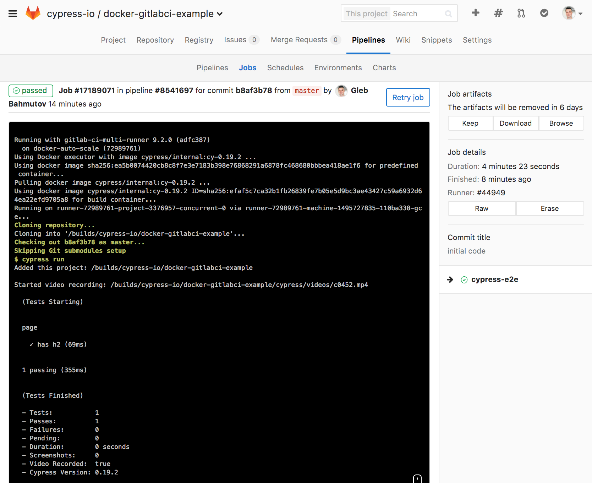

> Cypress + Docker + GitLabCI = ❤️

Running your Cypress E2E tests on GitLab CI is very simple. You can either
start with a base image or with an image that already includes Cypress tool.

## Base image

You can derive your custom CI image from
[cypress/base](https://hub.docker.com/r/cypress/base/) and install
`cypress`. Here is a typical `.gitlab-ci.yml` file

```yaml
image: cypress/base
cypress-e2e:
  script:
    - npm install -g cypress-cli
    - cypress install --cypress-version 0.19.2
    # run Cypress in headless CI mode
    - cypress run
```

**Hint** it is always a good idea to specify the exact version of a tool
when installing it to avoid breaking changes

## Complete image

To make things even simpler we have made a Docker image
[cypress/internal](https://hub.docker.com/r/cypress/internal/)
with Cypress pre-installed. Its tags follow pattern
`cypress/internal:cy-<version>` with `<version>` being the installed
Cypress version.

A typical `.gitlab-ci.yml` file would just contain the test command

```yaml
image: cypress/internal:cy-0.19.2
cypress-e2e:
  stage: test
  script:
    - cypress run
```

See the [.gitlab-ci.yml](.gitlab-ci.yml) in this project; we store generated
screenshots and videos as artifacts.



## Happy testing

If you find problems with Cypress and CI, please

- consult the [documentation](https://on.cypress.io)
- ask in our [Gitter channel](https://gitter.im/cypress-io/cypress)
- find an existing [issue](https://github.com/cypress-io/cypress/issues)
  or open a new one
